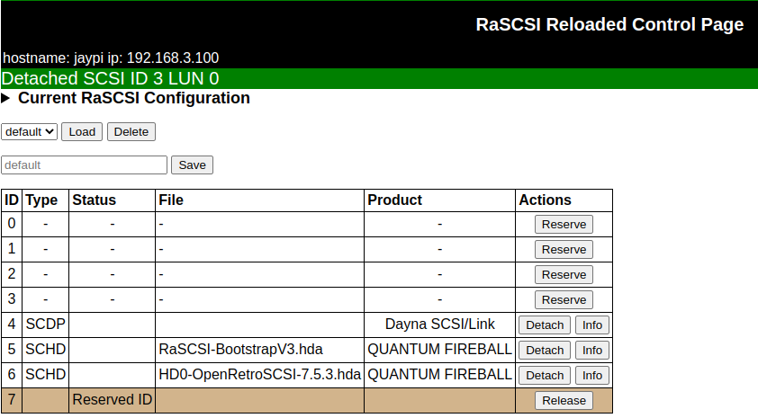

## Mount Daynaport

These instructions were adapted from the [RaSCSI wiki](https://github.com/akuker/RASCSI/wiki/Dayna-Port-SCSI-Link#open-transport)

Use the commandline since attaching the proxyARP-bridged Daynaport through the web interface returns an error.
#

    sudo rasctl -i 5 -c attach -t scdp -f eth0:192.168.3.0/24

### Verify ~/.config/rascsi/default.json file

    {
        "version": "22.7.2",
        "devices": [
            {
                "id": 4,
                "unit": 0,
                "device_type": "SCDP",
                "image": null,
                "params": {
                    "inet": "192.168.3.0/24",
                    "interface": "eth0"
                },
                "vendor": "Dayna",
                "product": "SCSI/Link",
                "revision": "1.4a",
                "block_size": null,
                "size": 0
            },
            {
                "id": 6,
                "unit": 0,
                "device_type": "SCHD",
                "image": "/home/pi/images/HD0-OpenRetroSCSI-7.5.3.hda",
                "params": {},
                "vendor": "QUANTUM",
                "product": "FIREBALL",
                "revision": "2207",
                "block_size": 512,
                "size": 524288000
            }
        ],
        "reserved_ids": [
            {
                "id": "7",
                "memo": ""
            }
        ]
    }

### Confirm ras0 bridge is present.  Will show up as 'degraded' and 'unmanaged' but actually works

    networkctl

    IDX LINK          TYPE     OPERATIONAL      SETUP
    1 lo            loopback carrier          unmanaged
    2 eth0          ether    no-carrier       configuring
    3 rascsi_bridge bridge   degraded-carrier configured 
    4 wlan0         wlan     routable         configured 
    6 ras0          ether    degraded         unmanaged

    brctl show

    bridge name	        bridge id		    STP enabled	  interfaces
    rascsi_bridge		8000.36873c9d0b82	no		       eth0
                                                           ras0

### Dayna SCSI/Link now shows up in the web interface
