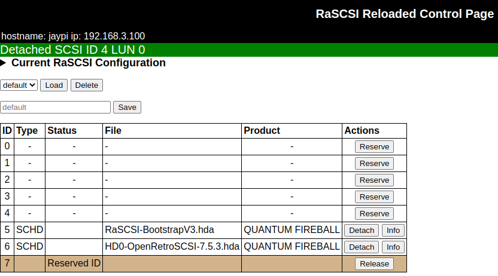
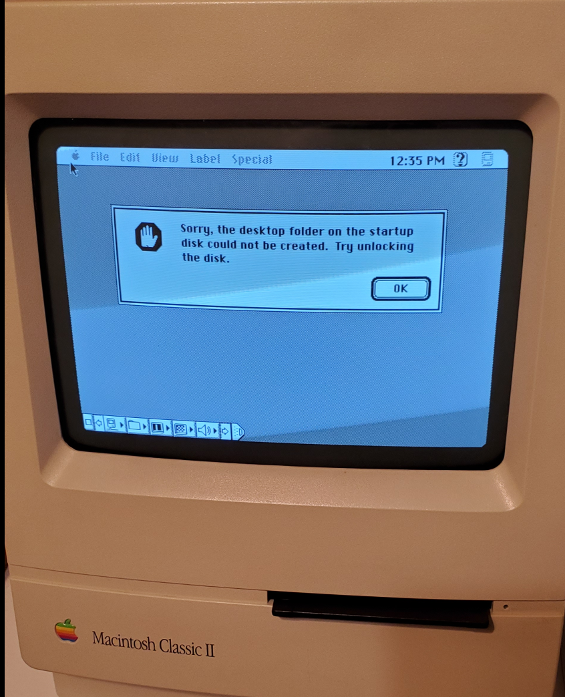
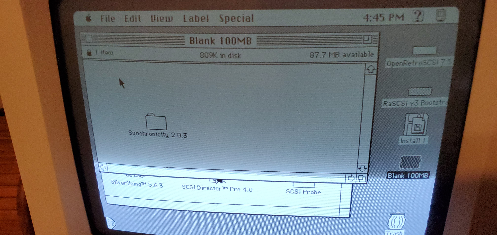
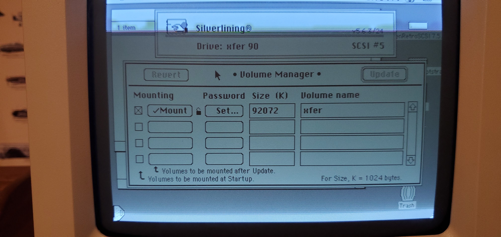
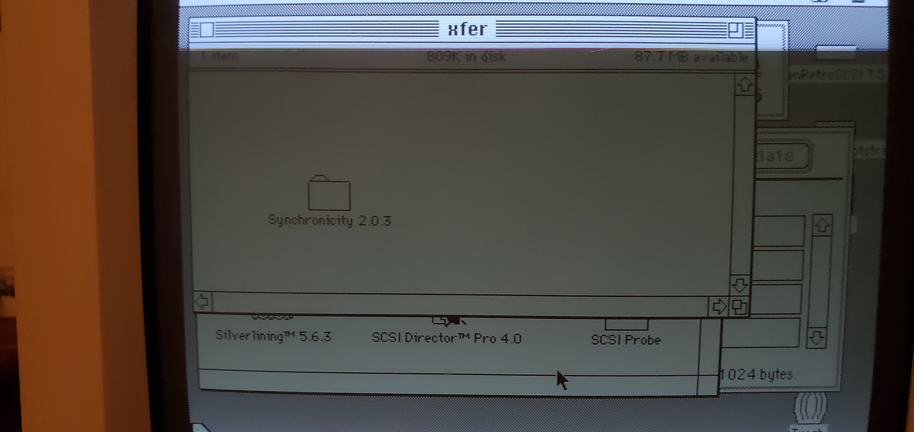

## Mount HDA Images
using the web interface
###
I found the Mac Librarian tutorial to be very helpful.  You can either do a clean OS install on a blank hd image or download a premade image from either the Macintosh Garden or the BlueSCSI site.

[Mac Librarian tutorial - Mac Setup and RaSCSI web interface](https://www.youtube.com/watch?v=-qRG-0Pne-I&t=400s)

[Macintosh Garden RaSCSI images](https://macintoshgarden.org/apps/rascsi-reloaded)

Premade images from EricHelgeson's BlueSCSI [wiki](https://github.com/erichelgeson/BlueSCSI/wiki/Usage#premade-images)

[BlueSCSI premade images](https://mega.nz/folder/8hA3AQCJ#pWUq92L70yDXlogy9lk5Dg)

I had success using this image:
[7.5.3 Image](https://mega.nz/folder/8hA3AQCJ#pWUq92L70yDXlogy9lk5Dg/file/hkIxnQ4S)

### Upload then mount System 7.5.3 and RaSCSI bootstrap v3 hard drive images

### If an image comes up as "write protected" use Silverlining to unlock

###
{:style="height:200px;width:200px"}
{:style="height:200px;width:400px"}
###
{:style="height:150px;width:300px"}
{:style="height:150px;width:300px"}