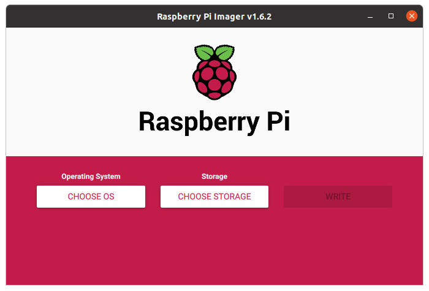
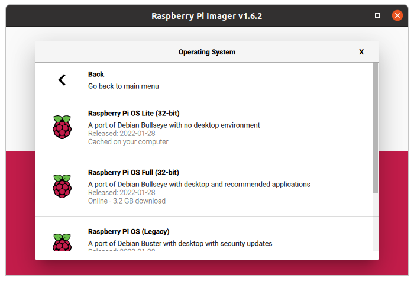
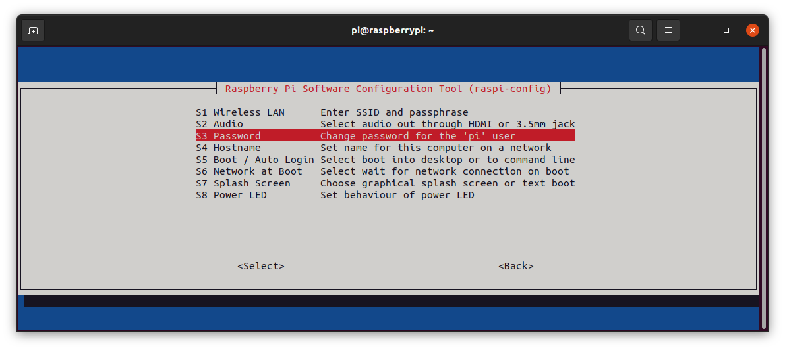
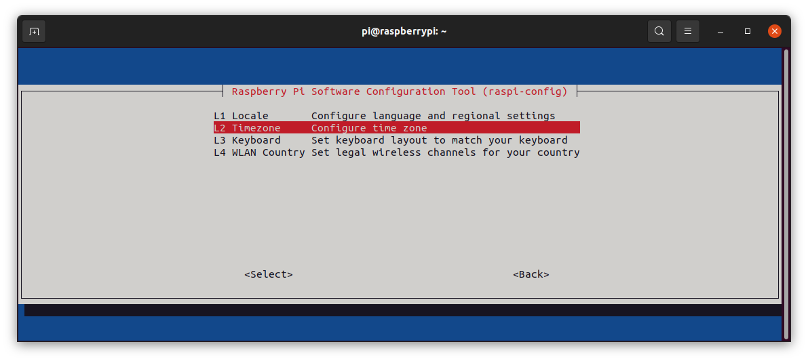
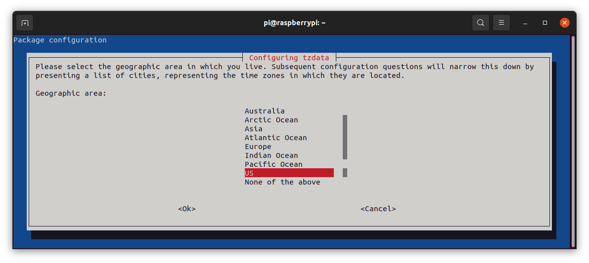
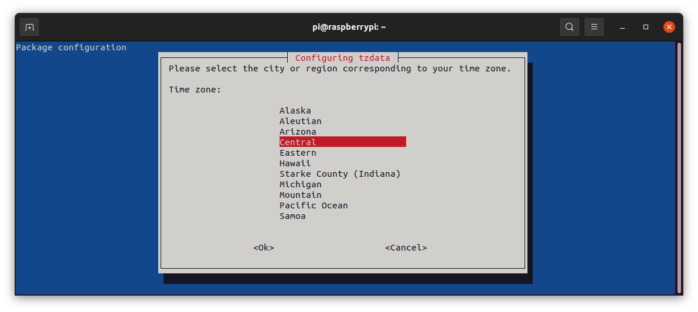
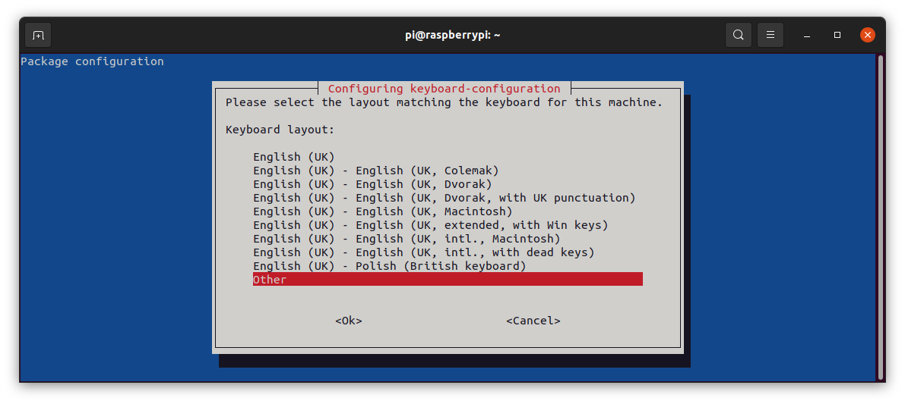
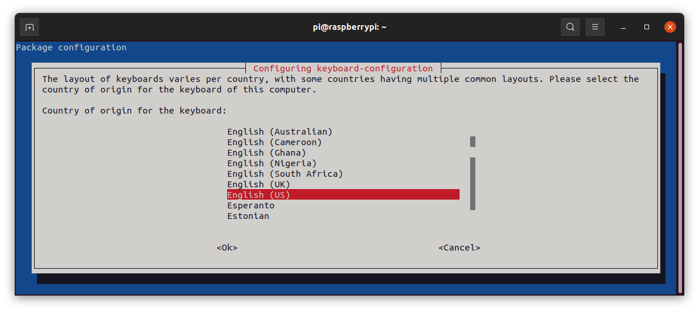
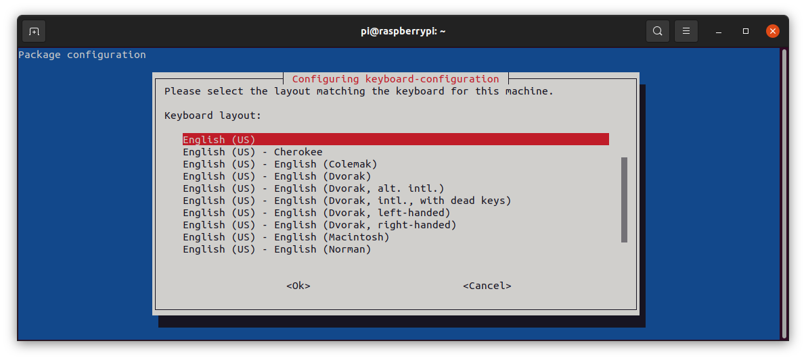

# Install Raspberry PI OS image 
on an SD card or USB flash drive 

Follow [Getting Started](https://www.raspberrypi.com/documentation/computers/getting-started.html) instructions on official raspberrypi.com website

Strongly recommend using the Raspberry PI Imager and selecting
"Raspberry Pi OS Lite (32-bit)"

{:style="height:200px;width:300px"}

select "Raspberry Pi OS (other)"

{:style="height:200px;width:300px"}

select "Raspberry Pi OS Lite (32-bit)"

{:style="height:200px;width:300px"}

    
## Launch Raspi-Config
from raspberry pi terminal
#
    pi@raspberrypi:~$ sudo raspi-config
   

{:style="height:200px;width:300px"}

## System Options
you may want to change Password and Hostname

{:style="height:200px;width:300px"}

## Interface Options
enable SSH for remote access

{:style="height:200px;width:300px"}

## Localization Options
{:style="height:200px;width:300px"}
#
Under Locale, use spacebar to deselect "en_GB.UTF-8 UTF-8"

{:style="height:200px;width:300px"}

and select "en_US.UTF-8 UTF-8 

{:style="height:200px;width:300px"}

none

{:style="height:200px;width:300px"}

Timezone

{:style="height:200px;width:300px"}

US

{:style="height:200px;width:300px"}

As we are favored enough to live in the The Republic of Texas

{:style="height:200px;width:300px"}

Keyboard

{:style="height:200px;width:300px"}

Generic 105-key PC (intl.)

{:style="height:200px;width:300px"}

Other

{:style="height:200px;width:300px"}

English (US)

{:style="height:200px;width:300px"}

Scroll up to English (US)

{:style="height:200px;width:300px"}

Default "Enter" the 2 screens then Finish

{:style="height:200px;width:300px"}
## Remote ssh login 
from PC terminal you can now remote login to your rascsi
##
    alex@xanadu_pc:~$ ssh pi@rascsi.local
    pi@rascsi:~$ 

## Update and Upgrade
##
    sudo apt update
    sudo apt upgrade